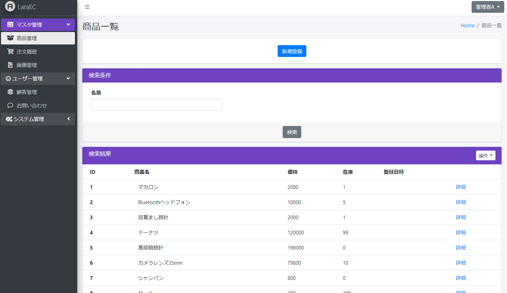

🌙 laravel-react-boilerplate
====

[](https://circleci.com/gh/circleci/circleci-docs)


## 📗 プロジェクトの概要

Laravel ＆ React.js の学習用サンプルアプリケーションです。

### 対象としている方
- Laravelを初めて学習してみたい方
- Dockerを利用したLaravelの開発環境を構築したい方
- ECサイトを学習してみたい方
- 管理画面も作成（マルチログイン）を作成したい方
- Stripeを利用した決算処理を作成してみたい方
- ソーシャルログインを作成してみたい方
- オブジェクトストレージへの画像アップロードを作成してみたい方
- フロントエンドをReact.jsで作成してみたい方

### 利用している技術

#### ■ インフラ
- Apache 2.4.46　・・・　WebサーバーとしてApacheを採用しました。自己証明書を設定済みなので開発環境でSSLとして動作可能です。
- MySQL 5.7　・・・　DBサーバーにはMySQLを採用しました。データファイルや設定ファイル、 ログなどはコンテナの外に出して 開発時に参照出来るようにしています。
- phpMyAdmin　・・・　起動したMySQLのデータを参照・編集するためのツールです。
- MailHog 　・・・　ダミーのSMTPサーバーです。送信したメールをブラウザで閲覧することが可能です。実際にはメールは送信されないので開発時の誤送信してしまう心配がありません。
- Minio 　・・・　S3に完全互換性のあるオブジェクトストレージです。アップロードした画像の保存先として利用しています。
- Redis 　・・・　永続化可能なインメモリデータベースです。DBから取得したデータのキャッシュとして利用しています。

#### ■ アプリケーション

- Laravel 6.20.17
- React 16.2.0
- React-Redux 7.2.2
- typescript 4.2.3
- Bootstrap 4.0.0
- Admin-LTE 3.1.0

## 🌐 Demo

#### ■ フロント画面（React）

https://laraec.isystk.com/


- ログイン/ログアウト
- 会員登録
- パスワードリマインダ
- 商品一覧
- カートに追加
- 決算処理（Stripe）
- お気に入り追加
- お問い合わせ
- ソーシャルログイン（Google）

#### ■ 管理画面（Bootstrap）

https://laraec.isystk.com/admin/



- ログイン/ログアウト
- 商品管理
- 注文履歴
- 顧客管理
- お問い合わせ管理
- 画像管理
- CSVダウンロード
- PDFダウンロード
- 画像アップロード

#### ■ バッチ処理

- 商品CSV出力バッチ
- S3商品画像アップロードバッチ

## 🔧 開発環境の構築

※ この環境を利用する為には、事前にdocker、docker-composeが動作する状態であることが前提条件です。
(Windowsの場合は、以下を参考に「WSL」と「Docker Desktop for Windows」を用意してください)

### WSLのインストール（Windowsの場合）
参考
https://qiita.com/matarillo/items/61a9ead4bfe2868a0b86

### Docker Desktop for Windows のインストール（Windowsの場合）

https://docs.docker.com/docker-for-windows/install/
```
↓コマンドプロンプトでバージョンが表示されればOK
docker --version
```

### WSLから、Docker for Windows を利用できるようにする（Windowsの場合）
参考
https://qiita.com/endo_hizumi/items/0cc50bdfbd827579733e
```
１．通知領域から、dockerのアイコンを右クリックして、Settingを選択
２．Generalのexpose deamon on~~のチェックを入れます。
３．ResourcesのWSL INTEGRATION から、"Ubuntu" をスイッチをONにします。（WSL2の場合のみ）

WSLの環境変数を変更（bashを利用している場合）→　WSL2の場合は不要です。（WSL1の場合のみ）
$ echo "export DOCKER_HOST=tcp://localhost:2375" >> ~/.bashrc && source ~/.bashrc

以下のように環境変数が通っていれば正常です。（WSL1の場合のみ）
$ echo $DOCKER_HOST
tcp://localhost:2375

WSL 側のルートを Docker for Windows に合わせるように WSL のマウント設定を行います。
$ sudo vi /etc/wsl.conf
---
[automount]
root = /
options = "metadata"
---

以下のように Cドライブのパスが"/mnt/c/"→"/c/" に変更されていれば正常です。
$ cd /c/Users/USER/github/laravel-react-boilerplate
$ pwd
/c/Users/USER/github/laravel-react-boilerplate

# WSL 上にDockerとDocker Composeをインストールする。
$ apt-get install docker
$ apt-get install docker-compose

これでWSLからWindows側にインストールしたDockerが利用できるようになります。
```

### MySQL Client のインストール

```
# MySQLに接続する為のコマンドをインストールします。（バージョンは何でもOK）

# Windowsの場合
$ apt-get install mysql-client

# Macの場合
$ brew install mysql-client
```

### Node.js のインストール

```
# Windowsの場合
$ curl -L git.io/nodebrew | perl - setup

# Macの場合
$ brew install nodebrew

# Node.js をインストール 
$ mkdir -p ~/.nodebrew/src
$ nodebrew ls-remote
$ nodebrew install v12.21.0
$ nodebrew use v12.21.0
$ npm install -g yarn
```

## 📦 ディレクトリ構造

```
.
├── docker （各種Daemon）
│   │
│   ├── apache （Webサーバー）
│   │   ├── conf.d (apacheの設定ファイル)
│   │   └── logs （apacheのログ）
│   ├── mysql （DBサーバー）
│   │   ├── conf.d (mysqlの設定ファイル)
│   │   ├── data (mysqlのデータファイル)
│   │   ├── init （mysqlの初期DDL）
│   │   ├── logs （mysqlのログ）
│   │   └── script （mysql関連のスクリプト）
│   ├── php （PHP-FRM）
│   │   └── logs （phpのログ）
│   ├── phpmyadmin （DB管理ツール）
│   └── s3 （オブジェクトストレージ）
│
├── htdocs （Apache公開ディレクトリ）
│   │
│   ├── app
│   │   ├── Console (バッチアプリケーション)
│   │   ├── Exceptions (例外処理)
│   │   ├── Http （Webアプリケーション）
│   │   ├── Models（モデル）
│   │   ├── Prociders（サービスプロバイダー）
│   │   └── Services（共通処理）
│   ├── bootstrap
│   ├── config
│   ├── database
│   ├── public
│   ├── resources
│   ├── routes
│   ├── storage
│   ├── tests
│   └── composer.json
└── dc.sh （Dockerの起動用スクリプト）
```

## 🖊️ Docker 操作用シェルスクリプトの使い方

```
Usage:
  dc.sh [command] [<options>]

Options:
  stats|st                 Dockerコンテナの状態を表示します。
  init                     Dockerコンテナ・イメージ・生成ファイルの状態を初期化します。
  start                    すべてのDaemonを起動します。
  stop                     すべてのDaemonを停止します。
  apache restart           Apacheを再起動します。
  mysql login              MySQLデータベースにログインします。
  mysql export <PAHT>      MySQLデータベースのdumpファイルをエクスポートします。
  mysql import <PAHT>      MySQLデータベースにdumpファイルをインポートします。
  mysql restart            MySQLデータベースを再起動します。
  php login                PHP-FPMのサーバーにログインします。
  php cache                Laravelのキャッシュをクリアします。
  php migrate              Laravelのマイグレードを実行します。
  php seed                 Laravelのテストデータを登録します。
  --version, -v     バージョンを表示します。
  --help, -h        ヘルプを表示します。
```

### phpMyAdmin 
データベースに接続してデータの参照や編集が可能です。
Dockerを起動後に以下のURLにアクセスすると利用可能です。

http://localhost:8888/


### mailhog 
ダミーのメールサーバーです。実際にはメールは送信されず、送信されたメールはブラウザで閲覧できます。
Dockerを起動後に以下のURLにアクセスすると利用可能です。

http://localhost:8025/

### minio
S3に準拠したダミーのオブジェクトストレージです。
Dockerを起動後に以下のURLにアクセスすると利用可能です。

http://s3:9000

```bash
# AWS-CLIにアクセスする。
$ ./dc.sh aws local
# バケットを作成する
> aws --endpoint-url http://s3:9000 s3 mb s3://laraec.isystk.com
# バケットを公開する
> POLICY='{ "Version": "2012-10-17", "Statement": [{ "Sid": "MakeItPublic", "Effect": "Allow", "Principal": "*", "Action": "s3:GetObject", "Resource": "arn:aws:s3:::laraec.isystk.com/*" }] }'
> aws --endpoint-url http://s3:9000 s3api put-bucket-policy --bucket laraec.isystk.com --policy "${POLICY}"
# バケットの一覧を確認する
> aws --endpoint-url http://s3:9000 s3 ls
# テストファイルをアップロードする
> aws --endpoint-url http://s3:9000 s3 cp ./front.png s3://laraec.isystk.com
$ open http://localhost:9090/laraec.isystk.com/front.png
```

## 💬 使い方

```
# 下準備
$ ./dc.sh init

# サーバーを起動する
$ ./dc.sh start

# データベースとPHPが立ち上がるまで少し待ちます。(初回は5分程度)

# MySQLにログインしてみる
$ ./dc.sh mysql login

# PHPサーバーにログインしてみる（composer や artisan などのコマンドは基本的にここで行う）
$ ./dc.sh php login

# .envをコピーする
> cp .env.example .env

# encryption keyを生成する
> php artisan key:generate

# モジュールをダウンロード
> composer update
> php artisan cache:clear
> php artisan config:clear
# テーブルとテストデータの作成
> php artisan migrate:fresh --seed
> chmod 777 -R bootstrap/cache
> chmod 777 -R storage
> chmod 777 -R public/uploads

# テスト用の画像をS3（Minio）にアップロードします。
> php artisan s3upload

# アップロードした画像を参照できるようにシンボリックリンクを作成する
> cd public
> ln -s ../storage/app/public uploads

# フロントエンドをビルドする。
$ cd htdocs
$ yarn && yarn run dev

# ブラウザでアクセス（フロント）
$ open https://localhost/

# ブラウザでアクセス（管理画面）
$ open https://localhost/admin/

# バッチを実行する（商品CSV出力バッチ）
$ ./dc.sh php login
$ php artisan stockcsv

# サーバーを停止する場合
$ ./dc.sh stop
```

## 🎨 参考

| プロジェクト| 概要|
| :---------------------------------------| :-------------------------------|
| [Laravel6公式ドキュメント](https://readouble.com/laravel/6.x/ja/)| Laravel6公式ドキュメントです。|
| [ヘルパ関数](https://readouble.com/laravel/6.x/ja/helpers.html)| Laravel の開発で便利なヘルパ関数の説明です。|
| [クエリービルダ](https://readouble.com/laravel/6.x/ja/queries.html)| Laravel の開発でDBアクセス時に必要なクエリービルダの説明です。|
| [AdminLTE Docs](https://adminlte.io/docs/2.4/installation)| AdminLTE Docs|
| [Bootstrap4 日本語リファレンス](https://getbootstrap.jp/docs/4.4/getting-started/introduction/)| Bootstrap4 日本語リファレンス|
| [fontawesome](https://fontawesome.com/icons?d=gallery)| アイコン表示で利用しています。|
| [Laravel5.4でマルチ認証（userとadmin）を実装する方法](https://takahashi-it.com/php/laravel54-multi-auth/)| Laravel でマルチ認証（userとadmin）を実装する方法で参考にしました。|
| [LaravelでのStripeの環境を作成する](https://takkublog.net/stripe01/)| Laravel で決算処理を作成する方法で参考にしました。 |
| [Laravel+Socialiteで簡単ソーシャルログイン実装!](https://qiita.com/KeisukeKudo/items/18dd8a342a4bdd43913c)| Laravel でソーシャルログインを作成する方法で参考にしました。 |
| [WSL2 で dns の名前解決ができなくなって ネット接続できなくなった場合の対処方法](https://qiita.com/kkato233/items/1fc71bde5a6d94f1b982)| WSL2 で dns の名前解決ができなくなって ネット接続できなくなった際に参考にしました。 |
| [Laravelの認証画面をReactで全とっかえ](https://qiita.com/shikigamix/items/99a4f2ab5911248f8b2f)| Laravelのフロントエンドの認証周りをReactで作成する方法で参考にしました。 |
| [react-bootstrap](https://react-bootstrap.github.io/components/)| BootstrapのReact用コンポーネント |


## 🎫 Licence

[MIT](https://github.com/isystk/laravel-react-boilerplate/blob/master/LICENSE)

## 👀 Author

[isystk](https://github.com/isystk)


